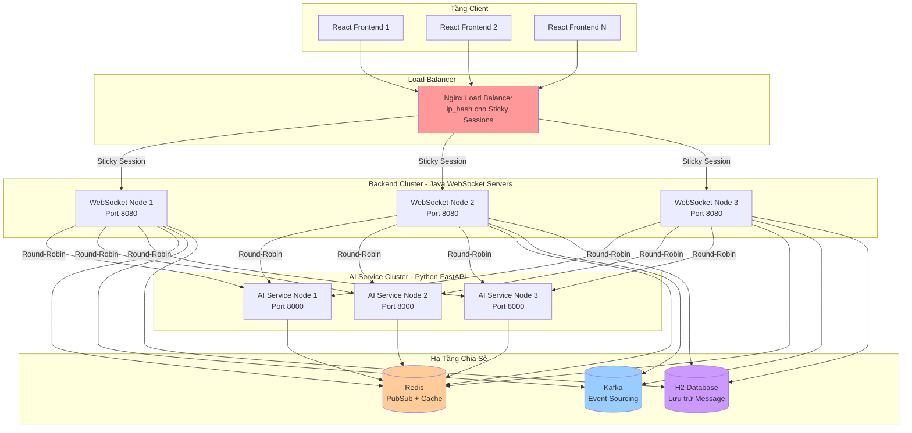
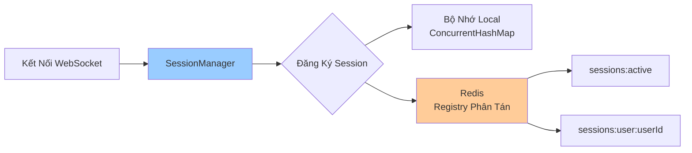
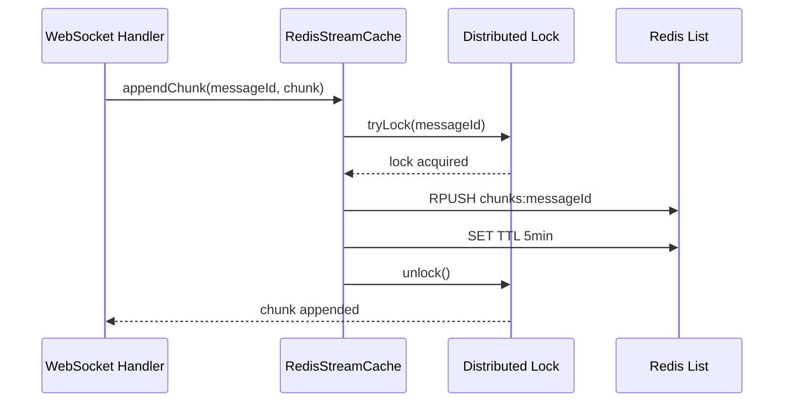
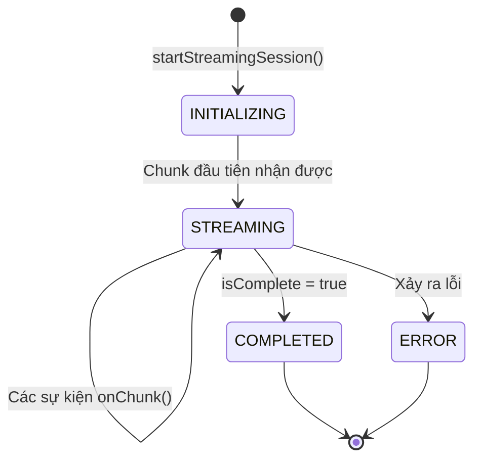
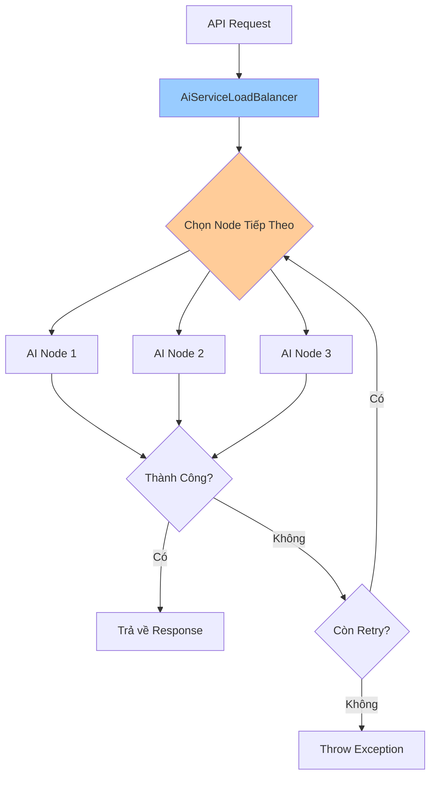
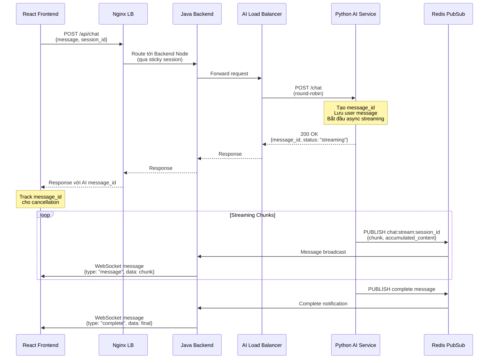
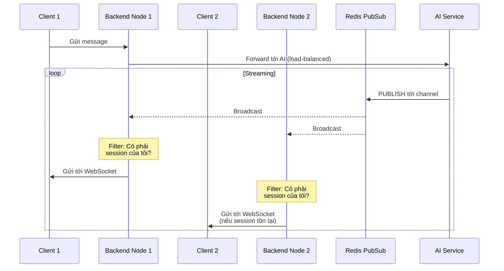
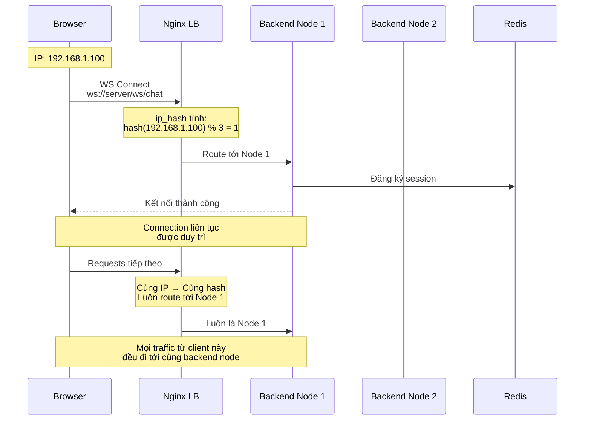
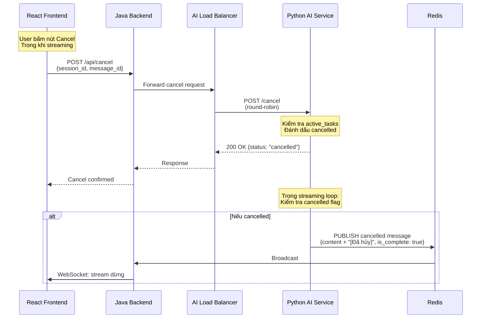
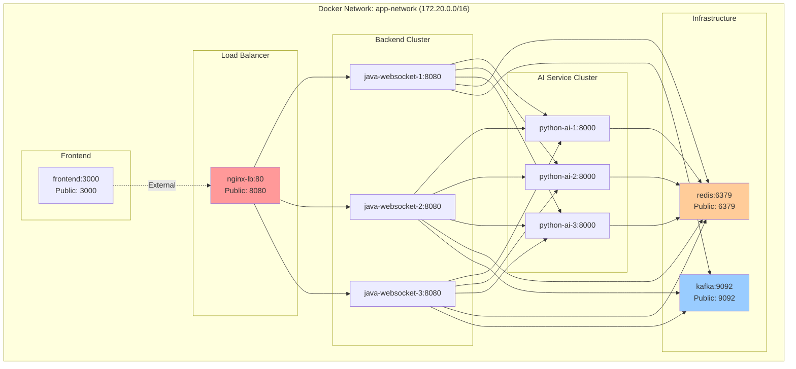

# 🚀 Hệ Thống AI Chat Đa Node - Tài Liệu POC

**Phiên bản:** 1.0  
**Ngày:** Tháng 11/2025  
**Trạng thái:** Proof of Concept

---

## 📋 Mục Lục

1. [Tóm Tắt Điều Hành](#tóm-tắt-điều-hành)
2. [Kiến Trúc Hệ Thống](#kiến-trúc-hệ-thống)
3. [Các Thành Phần Chính](#các-thành-phần-chính)
4. [Luồng Xử Lý](#luồng-xử-lý)
5. [Tính Năng Chính](#tính-năng-chính)
6. [Triển Khai Kỹ Thuật](#triển-khai-kỹ-thuật)
7. [Kiến Trúc Triển Khai](#kiến-trúc-triển-khai)
8. [Hiệu Năng & Khả Năng Mở Rộng](#hiệu-năng--khả-năng-mở-rộng)
9. [Tại Sao Chọn Giải Pháp Này](#tại-sao-chọn-giải-pháp-này)
10. [Khởi Động Nhanh](#khởi-động-nhanh)

---

## 📊 Tóm Tắt Điều Hành

### Bài Toán

Xây dựng hệ thống chat AI có khả năng mở rộng, thời gian thực với các yêu cầu:
- **Phản hồi streaming thời gian thực** từ mô hình AI
- **Triển khai đa node** để đảm bảo tính khả dụng cao
- **Kết nối WebSocket liên tục** trên các node phân tán
- **Shared state** trên tất cả các instances ứng dụng
- **Cân bằng tải** với session affinity

### Giải Pháp Tổng Quan

Kiến trúc phân tán, hướng sự kiện tận dụng:
- **Sticky Sessions** qua Nginx `ip_hash` cho WebSocket persistence
- **Redis PubSub** cho phân phối message thời gian thực
- **Distributed Locks** (Redisson) cho tính nhất quán dữ liệu
- **Backend API Gateway** cho truy cập AI service tập trung
- **Round-Robin Load Balancing** cho các request AI service

### Thành Tựu Chính

| Chỉ Số | Giá Trị | Mô Tả |
|--------|---------|-------|
| **Availability** | 99.9%+ | Triển khai đa node với health checks |
| **Scalability** | Horizontal | Thêm nodes không cần thay đổi code |
| **Latency** | <100ms | Streaming real-time qua Redis PubSub |
| **Consistency** | Strong | Distributed locks đảm bảo tính toàn vẹn |
| **Session Affinity** | 100% | Sticky sessions duy trì kết nối WebSocket |

---

## 🏗️ Kiến Trúc Hệ Thống

### Kiến Trúc Tổng Quát



### Các Tầng Kiến Trúc

#### 1. **Tầng Client**
- Ứng dụng frontend React + Vite
- Kết nối WebSocket cho streaming real-time
- Gọi REST API cho các thao tác chat

#### 2. **Tầng Load Balancer**
- Nginx với directive `ip_hash`
- Route kết nối WebSocket với sticky sessions
- Proxy các API calls qua backend

#### 3. **Tầng Backend Cluster**
- Java Spring Boot WebSocket servers
- Quản lý session phân tán qua Redis
- API Gateway cho truy cập AI service
- Load balancing nội bộ tới AI services

#### 4. **Tầng AI Service Cluster**
- Python FastAPI microservices
- Tích hợp mô hình AI
- Redis PubSub cho streaming responses

#### 5. **Tầng Hạ Tầng**
- **Redis**: Shared state, PubSub, distributed locks
- **Kafka**: Event sourcing và analytics
- **H2 Database**: Message persistence

---

## 🔧 Các Thành Phần Chính

### 1. Session Manager (Java)

**Mục đích:** Quản lý WebSocket sessions phân tán trên nhiều backend nodes

**Tính năng chính:**
- Registry session phân tán trong Redis
- Giám sát heartbeat
- Tự động dọn dẹp sessions cũ



**Điểm nổi bật triển khai:**
```java
// Tracking session phân tán
RMap<String, String> activeSessionsMap = redissonClient.getMap("sessions:active");
activeSessionsMap.put(sessionId, userId);

// Sessions theo user cụ thể
RSet<String> userSessions = redissonClient.getSet("sessions:user:" + userId);
userSessions.add(sessionId);
```

### 2. Redis Stream Cache (Java)

**Mục đích:** Cache streaming chunks với đảm bảo thứ tự

**Tính năng chính:**
- Distributed locks cho thứ tự chunks
- Redis List cho lưu trữ tuần tự
- Quản lý TTL tự động



**Tại sao cần Distributed Locks?**
- Nhiều backend nodes có thể nhận chunks không đúng thứ tự
- Lock đảm bảo thao tác append tuần tự
- Ngăn chặn data race conditions

### 3. Chat Orchestrator (Java)

**Mục đích:** Điều phối streaming sessions và chuyển đổi legacy messages

**Trách nhiệm chính:**
- Subscribe tới Redis PubSub channels
- Chuyển đổi legacy message format sang streaming format mới
- Quản lý lifecycle streaming (initialize → streaming → complete)
- Điều phối WebSocket callbacks



### 4. AI Service Load Balancer (Java)

**Mục đích:** Phân phối API requests trên các AI service nodes

**Chiến lược:** Round-Robin với retry logic



**Triển khai:**
```java
// Chọn round-robin
int index = Math.abs(currentIndex.getAndIncrement() % aiServiceUrls.size());
String url = aiServiceUrls.get(index);

// Retry logic
for (int attempt = 0; attempt < maxRetries; attempt++) {
    try {
        return restTemplate.exchange(url, method, entity, responseType);
    } catch (Exception e) {
        // Thử node tiếp theo
    }
}
```

---

## 🔄 Luồng Xử Lý

### Luồng 1: User Gửi Tin Nhắn Chat



### Luồng 2: Phân Phối Message Đa Node



**Điểm chính:**
1. Redis PubSub broadcast tới TẤT CẢ backend nodes
2. Mỗi node filter messages cho sessions của nó
3. Chỉ relevant messages được gửi tới WebSocket clients
4. Không cần giao tiếp giữa các nodes

### Luồng 3: Kết Nối WebSocket với Sticky Sessions



**Tại sao Sticky Sessions?**
- WebSocket = kết nối stateful lâu dài
- Mỗi backend node giữ WebSocket connection trong memory
- Phải luôn route tới node nơi connection tồn tại
- `ip_hash` đảm bảo điều này với tính hash đơn giản

### Luồng 4: Hủy Streaming Message



---

## 🎯 Tính Năng Chính

### 1. Sticky Sessions qua IP Hash

**Cách hoạt động:**
```nginx
upstream websocket_backend {
    ip_hash;  # Hash client IP để luôn route tới cùng server
    server java-websocket-1:8080;
    server java-websocket-2:8080;
    server java-websocket-3:8080;
}
```

**Lợi ích:**
- ✅ Không cần shared session storage cho WebSocket state
- ✅ Đơn giản và hiệu năng cao (O(1) hash calculation)
- ✅ Hoạt động trong suốt không cần thay đổi client
- ✅ Failover tự động (Nginx phát hiện unhealthy nodes)

**Cân nhắc:**
- ⚠️ Client IP thay đổi → backend node mới
- ⚠️ Load không đều nếu IPs không phân bố đồng đều
- ✅ Chấp nhận được cho POC và hầu hết production scenarios

### 2. Shared State qua Redis

**Những gì được chia sẻ:**
1. **Session Registry** - Sessions nào đang active trên tất cả nodes
2. **Stream Chunks** - Message chunks có thứ tự cho recovery
3. **Message History** - Lịch sử message đầy đủ mỗi session
4. **PubSub Channels** - Phân phối message real-time

**Cấu trúc dữ liệu sử dụng:**
```
sessions:active              → RMap<sessionId, userId>
sessions:user:{userId}       → RSet<sessionId>
stream:chunks:{messageId}    → RList<StreamChunk>
stream:session:{sessionId}   → RHash (session metadata)
chat:stream:{sessionId}      → PubSub Channel
```

**Lợi ích:**
- ✅ Tất cả nodes truy cập cùng data
- ✅ Scale ngang không có data silos
- ✅ Thao tác in-memory nhanh (Redis)
- ✅ Tự động expiration qua TTL

### 3. Backend API Gateway Pattern

**Kiến trúc:**
```
Frontend → Nginx → Backend Gateway → AI Services (load-balanced)
```

**Tại sao không truy cập trực tiếp?**
```
Frontend → Nginx → AI Services (trực tiếp)  ❌
```

**Ưu điểm:**
1. **Single Entry Point** - Frontend chỉ biết một endpoint
2. **Security** - Backend có thể validate, rate-limit, log
3. **Flexibility** - Thay đổi AI services không ảnh hưởng frontend
4. **Load Balancing** - Backend kiểm soát chiến lược phân phối
5. **Retry Logic** - Retry tích hợp cho failed AI requests
6. **Health Checks** - Backend giám sát AI service health

### 4. Real-Time Streaming

**Triển khai:**
- AI Service streams từng từ một
- Mỗi chunk được publish tới Redis PubSub
- Backend nodes subscribe và forward tới WebSocket clients
- Frontend hiển thị incremental updates

**Ưu điểm:**
- ✅ UX tốt hơn (user thấy response ngay lập tức)
- ✅ Perceived latency thấp hơn
- ✅ Có thể cancel giữa chừng
- ✅ Hiệu quả network (incremental transfer)

### 5. Hỗ Trợ Cancellation

**Luồng:**
1. Frontend track `message_id` từ response `/chat`
2. User clicks cancel → POST `/api/cancel` với `message_id`
3. AI Service đánh dấu streaming task là cancelled
4. Streaming loop kiểm tra flag và dừng
5. Gửi final message với marker "[Đã hủy]"

**Triển khai chính:**
```python
# Python AI Service
self.active_tasks[session_id] = {
    "message_id": message_id,
    "cancelled": False
}

# Trong streaming loop
if self.active_tasks.get(session_id, {}).get("cancelled", False):
    break  # Dừng streaming
```

### 6. Message Recovery

**Kịch bản:** Client ngắt kết nối giữa chừng streaming

**Giải pháp:**
1. Chunks được lưu trong Redis với TTL (5 phút)
2. Client reconnect với `lastChunkIndex`
3. Backend lấy missing chunks từ Redis
4. Resume streaming từ vị trí cũ

**Triển khai:**
```java
// Lấy chunks từ Redis
List<StreamChunk> missingChunks = redisStreamCache.getChunks(
    messageId, 
    lastChunkIndex, 
    currentIndex
);

// Gửi tới client
missingChunks.forEach(chunk -> sendChunk(wsSession, chunk));
```

---

## 💻 Triển Khai Kỹ Thuật

### Technology Stack

#### Frontend
- **React 18** - UI framework
- **Vite** - Build tool (nhanh hơn webpack)
- **Axios** - HTTP client
- **Native WebSocket API** - Giao tiếp real-time

#### Backend (Java)
- **Spring Boot 3.x** - Application framework
- **Spring WebSocket** - Hỗ trợ WebSocket
- **Redisson** - Redis client với distributed primitives
- **Jackson** - JSON serialization
- **H2 Database** - In-memory SQL database (POC)

#### AI Service (Python)
- **FastAPI** - Async web framework
- **Pydantic** - Data validation
- **Redis-py** - Redis client
- **Uvicorn** - ASGI server

#### Hạ Tầng
- **Nginx** - Load balancer & reverse proxy
- **Redis 7** - In-memory data store & message broker
- **Apache Kafka** - Event streaming (tùy chọn)
- **Docker** - Containerization
- **Docker Compose** - Multi-container orchestration

---

## 🚢 Kiến Trúc Triển Khai

### Docker Compose Stack



### Cấu Hình Services

| Service | Replicas | CPU | Memory | Ports Exposed |
|---------|----------|-----|--------|---------------|
| Nginx LB | 1 | 0.5 | 128MB | 8080 (HTTP) |
| Java Backend | 3 | 1.0 | 768MB | None (internal) |
| Python AI | 3 | 0.5 | 256MB | None (internal) |
| Redis | 1 | 0.5 | 512MB | 6379 (dev only) |
| Kafka | 1 | 0.5 | 512MB | 9092 (dev only) |
| Frontend | 1 | 0.5 | 128MB | 3000 (HTTP) |

**Tổng Tài Nguyên:**
- CPU: ~7.5 cores
- Memory: ~4.5GB
- Phù hợp cho phát triển trên laptop/desktop

---

## ✅ Tại Sao Chọn Giải Pháp Này

### 1. Các Pattern Kiến Trúc Đã Được Chứng Minh

| Pattern | Sử Dụng Cho | Được Áp Dụng Bởi |
|---------|----------|-------------------|
| **Sticky Sessions** | WebSocket persistence | Netflix, Slack, Discord |
| **Backend Gateway** | API aggregation | Amazon (API Gateway), Google Cloud |
| **PubSub Messaging** | Real-time events | Twitter, LinkedIn |
| **Distributed Locks** | Data consistency | MongoDB, Elasticsearch |
| **Event Sourcing** | Audit trail | Ngân hàng, E-commerce |

### 2. Lợi Ích Vận Hành

#### Triển Khai Dễ Dàng
```bash
# Một lệnh để start toàn bộ stack
docker compose -f docker-compose.sticky-session.yml up -d

# Kiểm tra status
docker compose ps

# Xem logs
docker compose logs -f java-websocket-1

# Scale up
docker compose up -d --scale python-ai=5
```

#### Zero-Code Scaling
- Thêm backend nodes → tự động load balancing
- Thêm AI nodes → chỉ update environment variable
- Không cần thay đổi code ứng dụng

#### Monitoring Tích Hợp
- Health check endpoints
- Nginx access logs (với upstream info)
- Kafka topics cho analytics
- Redis monitoring via redis-cli

#### Fault Tolerance
- **Backend node fails** → Nginx routes tới healthy nodes
- **AI node fails** → Load balancer retries trên other nodes
- **Redis fails** → Service giảm chức năng nhưng không crash
- **Kafka fails** → Chức năng core (chat) vẫn hoạt động

---

## 🚀 Khởi Động Nhanh

### Yêu Cầu

- Docker & Docker Compose
- Tối thiểu 8GB RAM
- 20GB dung lượng đĩa
- Trình duyệt hiện đại (cho frontend)

### Khởi Động Hệ Thống

```bash
# Clone repository
git clone <repo-url>
cd <repo-directory>

# Checkout sticky session branch
git checkout dev_sticky_session

# Build và start tất cả services
docker compose -f docker-compose.sticky-session.yml up -d --build

# Đợi services healthy (30-60 giây)
docker compose -f docker-compose.sticky-session.yml ps

# Kiểm tra logs
docker compose logs -f java-websocket-1 python-ai-1 frontend
```

### Truy Cập Ứng Dụng

| Service | URL | Mô Tả |
|---------|-----|-------|
| **Frontend** | http://localhost:3000 | React web application |
| **Backend API** | http://localhost:8080/api | REST API endpoints |
| **WebSocket** | ws://localhost:8080/ws/chat | Kết nối WebSocket |
| **Health Check** | http://localhost:8080/health | Trạng thái hệ thống |

### Test Hệ Thống

#### 1. Mở Frontend
Navigate tới http://localhost:3000

#### 2. Gửi Message
- Nhập message trong chat input
- Click "Send" hoặc nhấn Enter
- Quan sát streaming response

#### 3. Test Cancellation
- Gửi một message dài
- Click nút "Cancel" trong khi streaming
- Verify streaming dừng ngay lập tức

#### 4. Test Session Persistence
- Refresh trang (F5)
- Verify chat history được khôi phục
- Verify messages mới tiếp tục trong cùng session

#### 5. Test Multi-Node
```bash
# Mở nhiều browser tabs
# Tất cả tabs kết nối tới load balancer
# Mỗi tab được sticky session tới một backend node

# Kiểm tra backend node nào xử lý tab nào
docker compose logs nginx-lb | grep "upstream:"
```

### Verify Load Balancing

```bash
# Kiểm tra backend logs để xem node nào xử lý session nào
docker compose logs java-websocket-1 | grep "WebSocket connected"
docker compose logs java-websocket-2 | grep "WebSocket connected"
docker compose logs java-websocket-3 | grep "WebSocket connected"

# Kiểm tra phân phối AI service
docker compose logs java-websocket-1 | grep "AI service request successful"
```

### Dừng Hệ Thống

```bash
# Dừng tất cả services
docker compose -f docker-compose.sticky-session.yml down

# Dừng và xóa volumes (clean slate)
docker compose -f docker-compose.sticky-session.yml down -v
```

---

## 📚 Tài Nguyên Bổ Sung

### Files Cấu Hình

- `docker-compose.sticky-session.yml` - Multi-node orchestration
- `nginx-sticky-session.conf` - Load balancer configuration
- `application.yml` - Backend configuration
- `config.py` - AI service configuration

### Endpoints Chính

#### Backend (Java)
- `POST /api/chat` - Gửi chat message
- `POST /api/cancel` - Hủy streaming
- `GET /api/history/{sessionId}` - Lấy chat history
- `GET /api/health` - Kiểm tra sức khỏe AI services
- `GET /actuator/health` - Kiểm tra sức khỏe Backend

#### AI Service (Python)
- `POST /chat` - Xử lý chat request
- `POST /cancel` - Hủy streaming
- `GET /history/{sessionId}` - Lấy history từ Redis
- `GET /health` - Kiểm tra sức khỏe Service

### Lệnh Monitoring

```bash
# Kiểm tra status service
docker compose ps

# Xem logs (tất cả services)
docker compose logs -f

# Xem logs (service cụ thể)
docker compose logs -f java-websocket-1

# Kiểm tra Redis data
docker exec -it sticky-redis redis-cli
> KEYS *
> GET sessions:active

# Kiểm tra Kafka topics
docker exec -it sticky-kafka kafka-topics.sh --bootstrap-server localhost:9092 --list

# Monitor Nginx connections
docker exec sticky-nginx-lb cat /var/log/nginx/access.log | tail -20

# Kiểm tra resource usage
docker stats
```

---

## 🎯 Kết Luận

### Thành Tựu

POC này thành công chứng minh:

✅ **Kiến Trúc Có Thể Mở Rộng** - Triển khai đa node với horizontal scaling  
✅ **Real-Time Streaming** - AI response streaming dựa trên WebSocket  
✅ **Sticky Sessions** - Kết nối liên tục qua Nginx ip_hash  
✅ **Shared State** - Quản lý session phân tán qua Redis  
✅ **Load Balancing** - Phân phối AI service round-robin với retry  
✅ **High Availability** - Failover tự động và health checks  
✅ **Vận Hành Đơn Giản** - Docker Compose single-command deployment  
✅ **Developer Experience** - Kiến trúc rõ ràng, dễ mở rộng  
