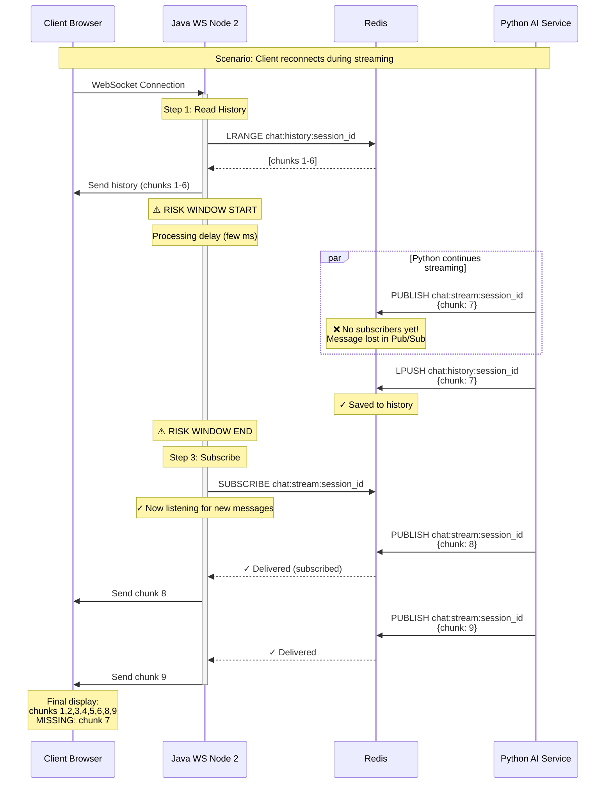

# 🔍 Phân Tích Chi Tiết Race Condition

## 📐 Kiến Trúc Hiện Tại

### Component Interactions



## 🔬 Code Analysis

### File: `ChatWebSocketHandler.java`

**Location:** `java-websocket-server/src/main/java/com/demo/websocket/handler/ChatWebSocketHandler.java`

```java
@Override
public void afterConnectionEstablished(WebSocketSession wsSession) throws Exception {
    // ... authentication, session setup ...
    
    // Line 98: Send welcome
    sendWelcomeMessage(wsSession, sessionId);

    // Line 101: STEP 1 - Read history from Redis
    sendChatHistory(wsSession, sessionId);
    
    // ========================================
    // ⚠️ RISK WINDOW: Lines 101-117
    // ========================================
    // Between reading history and subscribing,
    // Python AI Service might publish new chunks
    // These chunks will be MISSED!
    // ========================================
    
    // Line 104-106: STEP 3 - Subscribe to PubSub
    chatOrchestrator.startStreamingSession(sessionId, userId,
            new WebSocketStreamCallback(wsSession));
}
```

### Method: `sendChatHistory()`

```java
private void sendChatHistory(WebSocketSession wsSession, String sessionId) {
    try {
        // Read from Redis: LRANGE chat:history:{session_id} 0 -1
        List<ChatMessage> history = chatHistoryService.getHistory(sessionId);
        
        if (!history.isEmpty()) {
            String historyJson = objectMapper.writeValueAsString(Map.of(
                "type", "history",
                "messages", history
            ));
            sendMessageSynchronized(wsSession, historyJson);
        }
    } catch (Exception e) {
        log.error("Error sending history: {}", e.getMessage());
    }
}
```

**Problem:**
- ❌ This is a **non-atomic** operation
- ❌ No guarantee that no new messages arrive after reading
- ❌ Not synchronized with PubSub subscription

### Method: `startStreamingSession()` in `ChatOrchestrator.java`

```java
public void startStreamingSession(String sessionId,
                                  String userId,
                                  StreamCallback callback) {
    // ... create session, claim ownership ...
    
    // Line 117: Subscribe to Redis PubSub
    String legacyChannel = "chat:stream:" + sessionId;
    subscribeToLegacyChannel(legacyChannel, context);
}

private void subscribeToLegacyChannel(String channel, StreamingContext context) {
    MessageListener listener = (message, pattern) -> {
        // Handle incoming messages
    };
    
    ChannelTopic topic = new ChannelTopic(channel);
    listenerContainer.addMessageListener(listener, topic);
    
    // ⚠️ Subscription is now ACTIVE
    // But messages published BEFORE this point are LOST
}
```

## 🐛 Race Condition Details

### Window of Vulnerability

```
Time   | Java Node 2                    | Python AI Service        | Redis State
-------|-------------------------------|--------------------------|------------------
T0     | Connection established        |                          | history: [1-6]
       |                               |                          |
T1     | sendChatHistory()             |                          | history: [1-6]
       | → Read history: [1-6]         |                          |
       | → Send to client: [1-6]       |                          |
       |                               |                          |
T2     | ⚠️ Processing...              | Generate chunk 7         | history: [1-6]
       | (not subscribed yet)          | → PUBLISH chunk 7        | pubsub: (0 subs)
       |                               |                          | ❌ Lost!
       |                               |                          |
T3     | ⚠️ Processing...              | → LPUSH chunk 7          | history: [1-7]
       | (still not subscribed)        |   to history             |
       |                               |                          |
T4     | startStreamingSession()       |                          | history: [1-7]
       | → SUBSCRIBE channel           |                          | pubsub: (1 sub)
       | ✓ Now listening               |                          |
       |                               |                          |
T5     |                               | Generate chunk 8         | history: [1-7]
       | ✓ Receive chunk 8             | → PUBLISH chunk 8        | pubsub: → Node 2
       | → Send to client              |                          |
       |                               |                          |
T6     |                               | Generate chunk 9         | history: [1-7]
       | ✓ Receive chunk 9             | → PUBLISH chunk 9        | pubsub: → Node 2
       | → Send to client              |                          |
```

**Result:**
- Client sees: `[1, 2, 3, 4, 5, 6, 8, 9]`
- Redis has: `[1, 2, 3, 4, 5, 6, 7, 8, 9]`
- **Gap:** Chunk 7 is missing from client view

### Probability of Occurrence

**Low under normal conditions:**
- Risk window: ~1-5ms (time between read history and subscribe)
- Python AI Service: publishes every ~50ms

**Probability ≈ (risk_window / publish_interval) = 5ms / 50ms = 10%**

**Higher under high load:**
- Network latency increases
- GC pauses in Java
- Redis under load
- Risk window expands to 10-50ms

**Probability ≈ (30ms / 50ms) = 60%**

## 🎯 Affected Scenarios

### 1. Page Reload During Streaming ⚠️ HIGH RISK

```
User watches AI response streaming
→ User refreshes page (F5)
→ WebSocket reconnects
→ Java reads history (chunks 1-100)
→ ⚠️ Risk window
→ Python publishes chunks 101-105 (MISSED)
→ Java subscribes
→ User sees chunks 1-100, then 106+
→ Missing: 101-105
```

### 2. Network Reconnection ⚠️ MEDIUM RISK

```
User on mobile network
→ Network switches (WiFi → 4G)
→ WebSocket reconnects
→ Race condition window
→ Chunks might be missed
```

### 3. Load Balancer Rerouting ⚠️ LOW RISK

```
User connected to Node 1
→ Node 1 health check fails
→ Load balancer reroutes to Node 2
→ Node 2 establishes new connection
→ Race condition window
→ Data loss possible
```

### 4. Multiple Concurrent Connections ⚠️ VERY LOW RISK

```
User opens multiple tabs
→ Each tab connects to different nodes
→ Race condition per connection
→ Different tabs see different data
```

## 📈 Impact Assessment

### Data Integrity

- **Severity:** HIGH
- **User visible:** YES (missing text in conversation)
- **Data recovery:** IMPOSSIBLE (missed Pub/Sub messages are gone)
- **Workaround:** User must refresh again (might miss more chunks)

### Business Impact

- **User Experience:** ⭐⭐ (2/5) - Noticeable gaps in responses
- **Trust:** Reduced - users see incomplete messages
- **Support Tickets:** Likely increase
- **Data Consistency:** Violated

### Technical Debt

- **Complexity:** Medium
- **Testing:** Hard to reproduce (timing-dependent)
- **Monitoring:** Hard to detect
- **Fix Difficulty:** Medium (requires architectural change)

## 🔍 Detection Methods

### 1. Logging

```java
log.info("History loaded: chunks 1-{}", lastChunkInHistory);
log.info("Subscription started at timestamp: {}", System.currentTimeMillis());
// Then in callback:
log.info("Received chunk {} via PubSub", chunkIndex);
// → If gap detected: Log WARNING
```

### 2. Client-Side Detection

```javascript
// In frontend
const receivedChunks = new Set();
const expectedSequence = true;

function onChunkReceived(chunk) {
    receivedChunks.add(chunk.index);
    
    // Check for gaps
    const sorted = Array.from(receivedChunks).sort((a, b) => a - b);
    for (let i = 1; i < sorted.length; i++) {
        if (sorted[i] !== sorted[i-1] + 1) {
            console.error(`GAP DETECTED: Missing chunk ${sorted[i-1] + 1}`);
            // Could trigger recovery request
        }
    }
}
```

### 3. Monitoring Metrics

```java
// Metrics to track
metrics.recordHistoryRead(sessionId, chunksCount);
metrics.recordSubscriptionStarted(sessionId);
metrics.recordChunkReceived(sessionId, chunkIndex);

// Alert if:
// - chunk indices have gaps
// - time between history read and first chunk > threshold
// - user reports missing content
```

## 🧪 Test Cases

### Test 1: Simulate Race Condition

```python
# In test_race_condition.py
# 1. Setup history with chunks 1-6
# 2. Trigger WebSocket connection
# 3. Immediately publish chunk 7 (before subscribe completes)
# 4. Wait for subscription
# 5. Publish chunks 8-10
# 6. Verify client missed chunk 7
```

### Test 2: Stress Test

```python
# High-frequency reconnections
for i in range(100):
    connect()
    time.sleep(0.1)  # Small delay
    disconnect()
# → Count how many times chunks are missed
```

### Test 3: Concurrent Connections

```python
# Multiple clients connecting simultaneously
threads = []
for i in range(10):
    t = threading.Thread(target=connect_and_verify)
    threads.append(t)
    t.start()
# → Check if any client has data loss
```

## 🎓 Lessons from This Bug

### 1. Redis Pub/Sub Limitations

- **Not persistent:** Messages only delivered to active subscribers
- **No replay:** Can't read past messages
- **Timing-critical:** Must subscribe BEFORE publisher sends

### 2. Atomic Operations

- Reading history + subscribing should be **atomic**
- Or use techniques to ensure no messages missed

### 3. Distributed Systems Complexity

- **CAP theorem:** Can't have perfect consistency in distributed system
- **Trade-offs:** Need to choose appropriate architecture

### 4. Testing Challenges

- **Timing-dependent bugs** are hard to reproduce
- Need **deterministic tests** and **stress tests**
- **Monitoring** is crucial in production

## 🔧 Potential Solutions (Overview)

1. **Subscribe-First Pattern:** Subscribe BEFORE reading history
2. **Atomic Read-Subscribe:** Use Redis Streams or Kafka
3. **Sequence Numbers:** Client validates chunk sequence
4. **Heartbeat & Recovery:** Detect gaps and request missing chunks
5. **Idempotent Delivery:** Allow replaying chunks from history

Detailed solutions in `RACE_CONDITION_FIX.md`.

---

**Analysis Date:** 2025-11-11  
**Analyst:** AI Assistant  
**Severity:** HIGH  
**Status:** Documented & Reproduced
